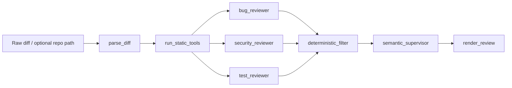

```mermaid
flowchart LR
    A["Raw diff / optional repo path"] --> B["parse_diff"]
    B --> C["run_static_tools"]
    C --> D["bug_reviewer"]
    C --> E["security_reviewer"]
    C --> F["test_reviewer"]
    D --> G["deterministic_filter"]
    E --> G
    F --> G
    G --> H["semantic_supervisor"]
    H --> I["render_review"]
```