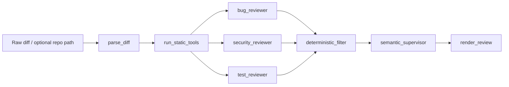

# Multi-Agent Code Review Agent

Production-shaped AI code review workflow for unified diffs. The system parses a
diff, runs deterministic static analysis when a repo path is available, fans out
to specialist reviewers, deduplicates findings through a supervisor node, and
renders a deterministic markdown review.

## Current Status

Implemented:

- Unified diff parser with changed files, hunks, added/removed lines, statuses, languages, and line numbers.
- LangGraph workflow: parse diff -> static tools -> bug/security/test reviewers -> deterministic filter -> supervisor -> renderer.
- Ruff and Bandit wrappers with normalized `ToolResult` objects and graceful failure behavior.
- Conservative deterministic reviewer baseline for correctness, security, and test coverage findings.
- Supervisor deduplication and severity ranking.
- FastAPI `/api/review` endpoint.
- Streamlit engineering-tool UI with diff input, findings, tool evidence, and agent trace views.
- Seeded eval harness with a true-positive auth bypass case and a false-positive safe refactor trap.
- Pytest coverage for parser, filtering, rendering, static-tool skip behavior, and graph smoke path.

Still planned:

- LLM-backed reviewer and semantic supervisor calls with structured outputs.
- More seeded eval cases and recommendation-quality scoring.
- Optional mypy, pytest, semgrep integrations.
- GitHub PR integration, inline comments, OAuth, and webhook handling.

## Architecture



Static tools run once in a shared node. Reviewers consume shared tool results
instead of shelling out independently.

## Run Locally

```bash
uv run pytest
uv run python -m evals.run_evals
uv run uvicorn backend.main:app --reload
uv run streamlit run frontend/app.py
```

CLI review:

```bash
uv run python scripts/run_review.py evals/test_diffs/auth_bypass_001.diff
```

## API

```http
POST /api/review
```

```json
{
  "raw_diff": "diff --git ...",
  "repo_path": "/optional/local/repo"
}
```

Response includes structured findings, markdown, normalized tool results,
metadata, and non-fatal errors.

## Eval Baseline

The current deterministic baseline catches `auth_bypass_001` and avoids findings
on `safe_refactor_001`.

Metrics tracked by the harness:

- Detection accuracy
- False positives
- File and line proximity
- Severity match
- Duplicate count

## Reliability Principles

- Diff parsing errors become input errors.
- Missing Ruff or Bandit records a tool error and continues.
- Reviewer nodes return empty findings rather than crashing the graph.
- Supervisor pass remains deterministic and can render filtered findings.
- The renderer is deterministic and does not rely on an LLM for final formatting.
