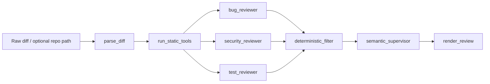

# Code Review Agent

A code review system that parses unified diffs, runs static analysis tools, and uses specialist reviewers to produce structured review reports.

## What It Does

You give it a code change (unified diff). It:

1. Parses the diff into structured data: files, hunks, added/removed lines with line numbers
2. Runs Ruff and Bandit if a local repo path is available
3. Sends the parsed diff and tool output to three specialist reviewers in parallel (bug, security, test coverage)
4. Filters out low-confidence and irrelevant findings, deduplicates by file and line
5. Runs a supervisor pass to merge related findings across reviewers
6. Renders a markdown review sorted by severity

### Example

Input: a diff that removes password verification from an auth function.

Output:

```
### 1. CRITICAL: Password verification bypassed

File: app/auth.py:13 | Confidence: 0.96 | Source: security_reviewer

The diff removes password verification while still issuing an authentication
token for an existing user. That allows login without proving knowledge of
the password.

Recommendation: Restore password validation before creating a token.
```

## Architecture




Built with LangGraph. Static tools run once in a shared node. Reviewers read shared tool results and parsed diff from state. No duplicate tool execution.

### Design Principles

- Static tools provide evidence. Reviewers interpret evidence. The supervisor decides what is worth saying.
- Reviewers emit structured `Finding` objects, not prose. The supervisor merges them. The renderer formats them. The eval harness scores them.
- Deterministic filtering runs before semantic consolidation: confidence thresholds, changed-line relevance checks, and exact deduplication happen without an LLM.
- Failures degrade, never crash. Missing tools, bad diffs, and reviewer errors all produce fallback behavior instead of exceptions.

## Current State

This is a **v1 deterministic baseline**. The reviewers use heuristic pattern matching (string analysis on added/removed code) combined with static tool output. They catch specific patterns: auth bypasses, dangerous APIs (`eval`, `pickle.loads`, `shell=True`), missing security tests. No LLM calls yet.

**What works:**
- Unified diff parser with full line-number tracking
- Ruff and Bandit integration with normalized output and graceful failure
- Three specialist reviewers with deterministic heuristics
- Supervisor deduplication with semantic fingerprinting
- FastAPI API (`POST /api/review`)
- Streamlit UI with diff input, findings, tool evidence, and agent trace views
- CLI review script
- Eval harness with seeded test cases and scoring
- Pytest suite covering parser, filter, renderer, tools, and full graph

**Next:**
- Expand golden dataset to 8-10 seeded cases (more true positives, more false-positive traps)
- Add LLM-backed reviewers behind the existing node interfaces. Heuristics become the fallback layer
- LLM-powered semantic supervisor for cross-file deduplication
- Reliability layer (retry with backoff, graceful LLM failure handling)

## Run Locally

```bash
# Install
uv sync

# Tests
uv run pytest

# Eval harness
uv run python -m evals.run_evals

# Review a diff file
uv run python scripts/run_review.py evals/test_diffs/auth_bypass_001.diff

# API server
uv run uvicorn backend.main:app --reload

# Frontend
uv run streamlit run frontend/app.py
```

## API

```http
POST /api/review
Content-Type: application/json

{
  "raw_diff": "diff --git a/app/auth.py b/app/auth.py\n...",
  "repo_path": "/optional/path/to/local/repo"
}
```

Response includes structured findings, markdown review, normalized tool results, metadata, and non-fatal errors.

## Eval Harness

The harness runs seeded diffs through the full graph and scores:

- Detection accuracy: did it catch the expected issue?
- False positive rate: did it flag clean changes?
- File and line proximity: did it point to the right location?
- Severity match: did severity meet or exceed expectations?
- Duplicate count: did the supervisor properly deduplicate?

Current baseline: catches `auth_bypass_001` (critical auth bypass) and passes `safe_refactor_001` (harmless variable rename, no findings expected).

## Project Structure

```
code-review-agent/
├── backend/
│   ├── graph.py                 # LangGraph wiring (imports + edges only)
│   ├── state.py                 # ReviewState definition
│   ├── models.py                # Finding, ToolResult, ParsedDiff, ReviewMetadata
│   ├── diff_parser.py           # Unified diff -> structured ParsedDiff
│   ├── renderer.py              # Findings -> markdown (deterministic, no LLM)
│   ├── main.py                  # FastAPI app
│   ├── nodes/
│   │   ├── parse_diff.py        # Diff parsing + metadata
│   │   ├── static_tools.py      # Ruff + Bandit execution
│   │   ├── bug_reviewer.py      # Correctness heuristics + ruff findings
│   │   ├── security_reviewer.py # Security heuristics + bandit findings
│   │   ├── test_reviewer.py     # Test coverage heuristics
│   │   ├── deterministic_filter.py  # Rule-based filtering + dedup
│   │   ├── semantic_supervisor.py   # Semantic fingerprint dedup
│   │   ├── render_review.py     # Node wrapper for renderer
│   │   └── reviewer_utils.py    # Shared helpers for reviewers
│   ├── api/
│   │   ├── routes.py            # POST /api/review
│   │   └── schemas.py           # Request/response models
│   └── tools/
│       ├── ruff_tool.py         # Ruff wrapper with normalized output
│       └── bandit_tool.py       # Bandit wrapper with normalized output
├── frontend/
│   └── app.py                   # Streamlit UI
├── evals/
│   ├── golden_dataset.json      # Seeded test cases
│   ├── run_evals.py             # Eval runner
│   ├── scorers.py               # Scoring logic
│   └── test_diffs/              # Diff files for eval cases
├── tests/                       # Pytest suite
├── scripts/
│   └── run_review.py            # CLI review tool
└── pyproject.toml
```

## Tech Stack

LangGraph · LangChain · FastAPI · Streamlit · Ruff · Bandit · Pydantic · Pytest


